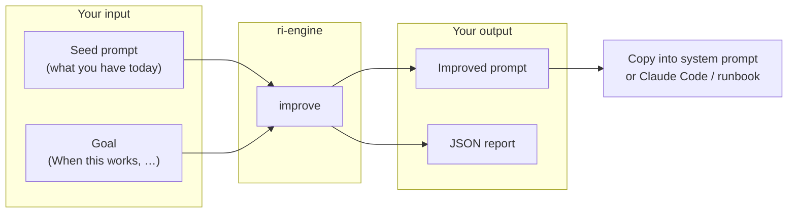
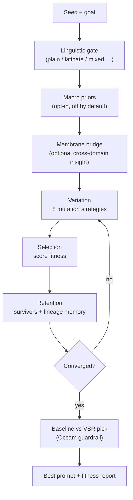
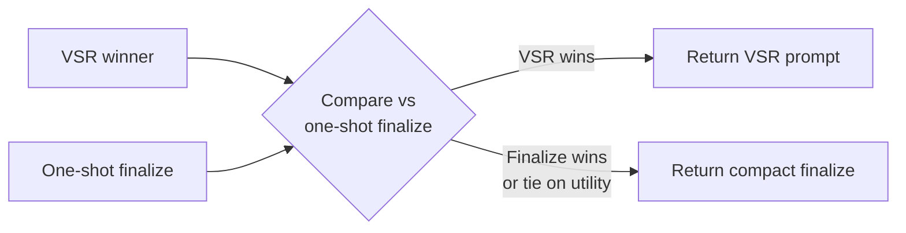
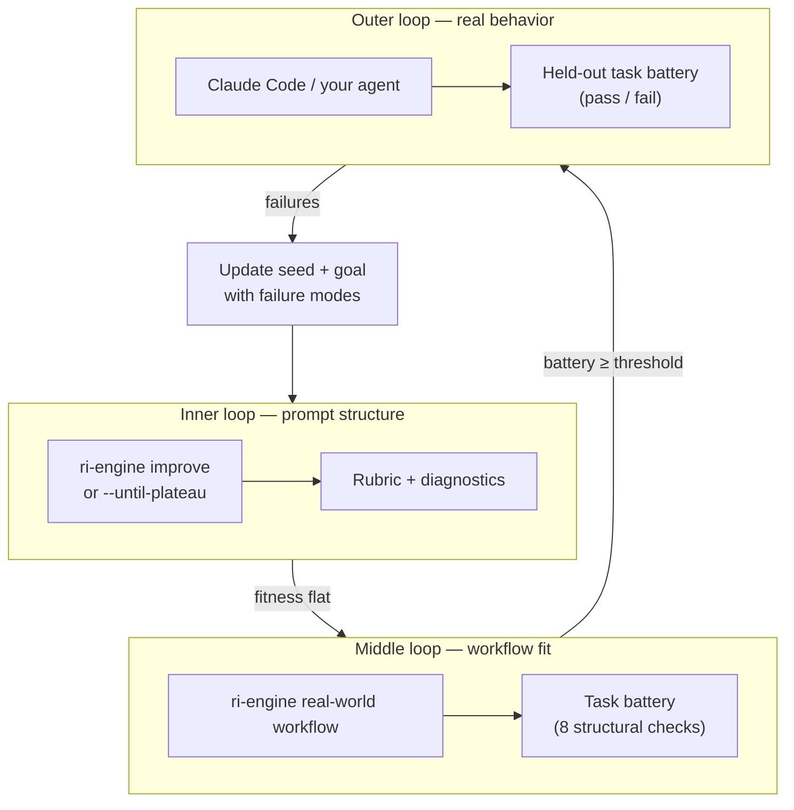
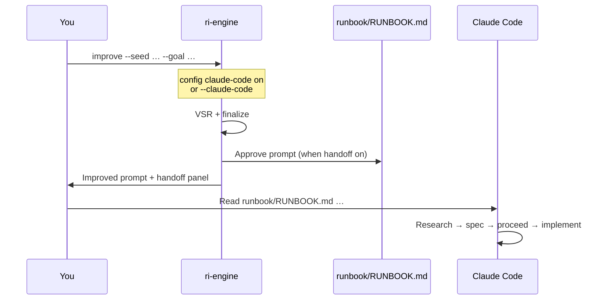
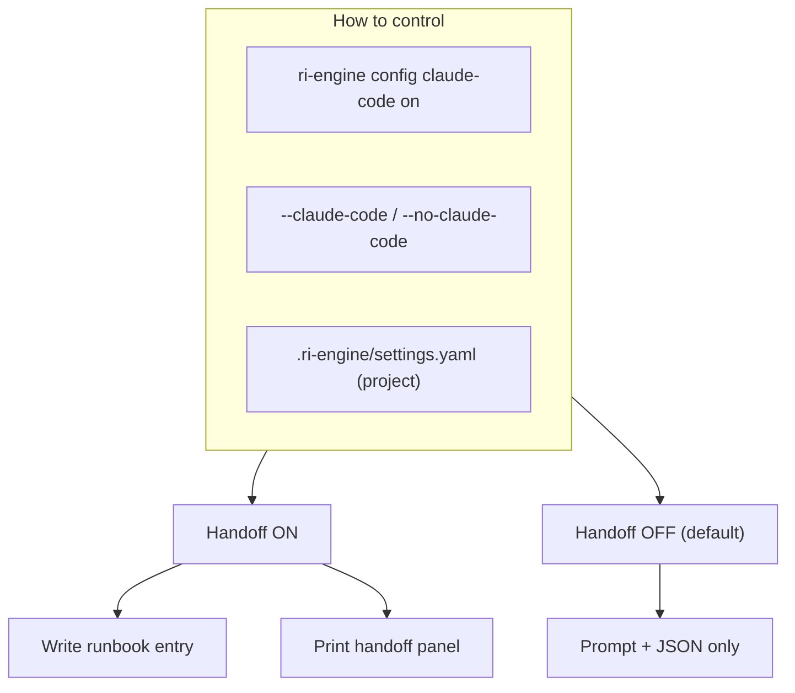
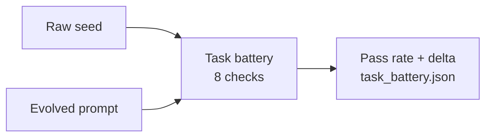
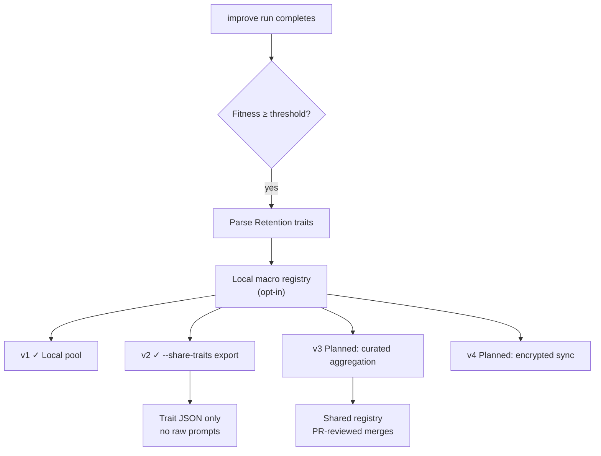
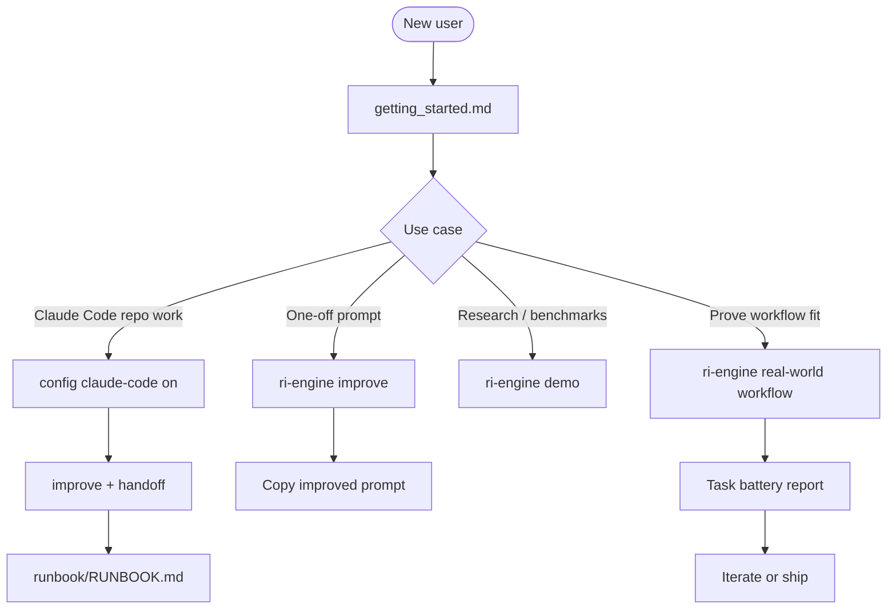

# Diagrams

Visual overview of **ri-engine** — how prompt improvement works, how to validate results, and how Claude Code fits in.

> GitHub renders these Mermaid charts in the markdown viewer. For a plain-text fallback, see [technical_reference.md](technical_reference.md).

---

## 1. What you do (30 seconds)



**Command:** `ri-engine improve --seed "…" --goal "…"`

---

## 2. VSR pipeline (how improvement runs)

Each **generation** runs Variation → Selection → Retention. The loop repeats until fitness plateaus or `max_generations` is reached.



**Honest scope:** default **mock** provider scores **structure** locally. It does not prove live LLM task success — use `--provider openai` or `--provider anthropic` for semantic rewriting, then evaluate tasks separately.

---

## 3. Baseline vs VSR (Occam guardrail)

VSR does not always beat a one-shot finalize. The engine returns the **simpler** result when the evolutionary winner adds bloat without gain.



---

## 4. Recursive validation — knowing when to stop

Three nested loops answer different questions. All three should plateau before you call the workflow “done.”



| Loop | Command | Stops when… |
|------|---------|-------------|
| Inner | `ri-engine improve --until-plateau` | Fitness gain below threshold |
| Middle | `ri-engine real-world workflow` | Task battery pass rate ≥ 85% and stable |
| Outer | Live agent on real tasks | Pass rate flat on held-out cases |

---

## 5. Claude Code integration

Handoff is **off by default**. Turn it on when you want runbook + terminal instructions after each improve run.



**Settings**



Details: [claude_code_integration.md](claude_code_integration.md)

---

## 6. Middle-loop task battery

When `metadata.task_battery` is set (e.g. `config/workflow_self_test.yaml`), the engine scores **seed vs evolved** against fixed checks.



Example checks: no code-review bleed, compact length, research→spec→implement, runbook reference, no benchmark boilerplate.

```bash
ri-engine real-world workflow
```

---

## 7. Collective intelligence (patterns, not secrets)

Local learning is built; federated sync is phased and opt-in.



**Principle:** personal prompts stay local; only **trait patterns** (e.g. `constraint_first`, `failure_mode_guards`) are candidates for pooling — gated by task batteries before any global merge.

Macro registry: **off by default** (`--use-persistent-macro-registry`).

---

## 8. Typical user paths



---

## Related docs

| Topic | Document |
|-------|----------|
| Install & first run | [getting_started.md](getting_started.md) |
| Claude Code handoff | [claude_code_integration.md](claude_code_integration.md) |
| Agent embedding | [agent_integration.md](agent_integration.md) |
| Architecture detail | [technical_reference.md](technical_reference.md) |
| Scope & limitations | [publication.md](publication.md) |
