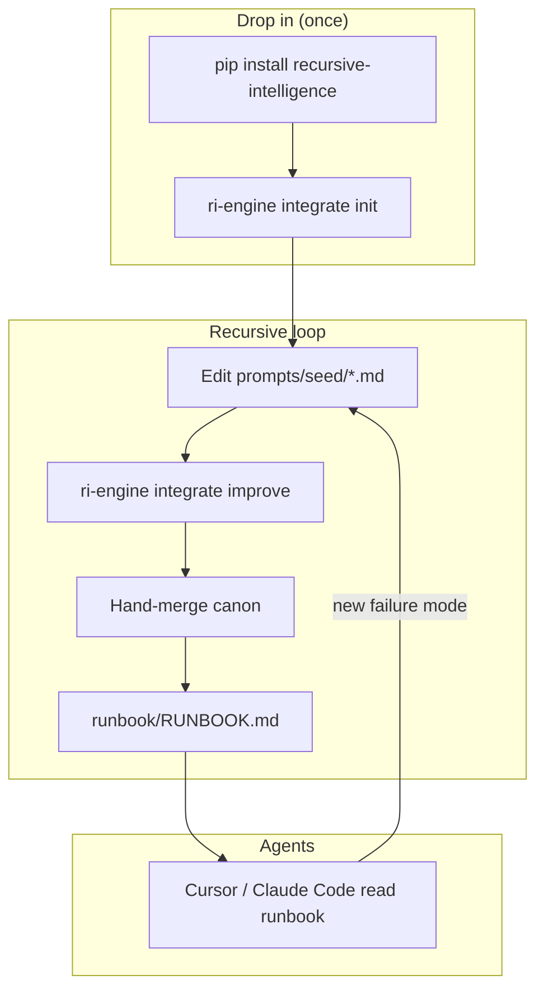
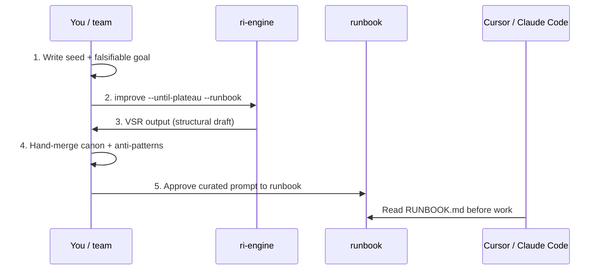

# Integration patterns

How to embed **ri-engine** in a real project — seed, config, runbook, and agent sessions.  
The **Hubzz spatial/district** integration is the reference case.

See also: [diagrams.md](diagrams.md) · [agent_integration.md](agent_integration.md) · [claude_code_integration.md](claude_code_integration.md)

---

## Plug-and-play (active repos)

Drop into any repo — one command scaffolds the Hubzz-style layout and manifest:

```bash
pip install recursive-intelligence
cd your-repo
ri-engine integrate init
ri-engine integrate improve
```

Creates `ri/config/`, `prompts/seed/`, `runbook/RUNBOOK.md`, `.ri-engine/project.yaml`, and `docs/prompt-improvement.md`. Merges `CLAUDE.md` / `AGENTS.md` into the seed when present.

```bash
ri-engine integrate status    # check manifest
ri-engine integrate improve   # until-plateau + runbook (recursive loop)
```

Full pattern: [integration_patterns.md](integration_patterns.md)

---

## What worked (Hubzz case study)

A monorepo integrated `recursive-intelligence` for spatial/district agent work:

```bash
pip install -e ".[prompts]"
# or: pip install recursive-intelligence
```

| Path | Purpose |
|------|---------|
| `runbook/RUNBOOK.md` | **Start here** — approved agent prompt for sessions |
| `prompts/seed/hubzz-spatial-agent.md` | Hand-written seed (edit when canon changes) |
| `ri/config/hubzz-spatial-district.yaml` | VSR config for `ri-engine improve` |
| `docs/prompt-improvement.md` | Team workflow docs |

**Improve command used:**

```bash
ri-engine improve \
  --config ri/config/hubzz-spatial-district.yaml \
  --provider mock \
  --until-plateau \
  --runbook
```

Or from seed + goal directly:

```bash
ri-engine improve \
  --seed prompts/seed/hubzz-spatial-agent.md \
  --goal "When this works, the agent compiles 50k districts with full publish package validation." \
  --until-plateau \
  --runbook
```

### Key lesson: high fitness ≠ domain-ready

VSR plateaued at **~97% fitness**, but the generic output still needed a **hand-merge** with Hubzz-specific rules:

- Faces-not-volume NESWUD canon
- Full publish package (`spawn_tile`, interfaces, no cherry-picked `publish_ok`)
- Anti-patterns from failed iterations (lattice planners, band monoliths, yes-man validation)

The curated result landed in `runbook/prompts/hubzz-spatial-district.md` — **practical, not meta-boilerplate**.

> **Takeaway:** ri-engine shapes structure; **you** own domain truth. Treat VSR output as a draft, then merge canon + anti-patterns before agents run.

---

## Recommended project layout



Copy the template manually: `config/integration.template.yaml` — or use **`ri-engine integrate init`**.

See [integration_patterns.md](integration_patterns.md) for the full case study.

---

## Five-step integration loop



| Step | Action | ri-engine helps | You must provide |
|------|--------|-----------------|------------------|
| 1 | Seed + goal | Clarity gate nudges vague goals | Falsifiable “When this works…” + domain canon |
| 2 | `--until-plateau --runbook` | VSR + fitness trajectory | `--config` or `--seed` + `--goal` |
| 3 | Review output | Baseline vs VSR pick, diagnostics | Judge generic vs domain-fit |
| 4 | Hand-merge | — | Anti-patterns, file paths, success checks |
| 5 | Agent sessions | Claude Code handoff (optional) | Point agents at `runbook/RUNBOOK.md` |

---

## Seed content that actually helps

Based on Hubzz and Claude Code integrations, strong seeds include:

### 1. Falsifiable goal (required)

```text
When this works, the agent compiles 50k districts with full publish package validation.
```

Not: “make the agent better at districts.”

### 2. Domain canon (required for specialized work)

```markdown
## Canon
- Faces-not-volume NESWUD rules
- Full publish package: spawn_tile, interfaces, no cherry-picked publish_ok
```

### 3. Anti-patterns from real failures (high leverage)

```markdown
## Anti-patterns (do not repeat)
- Lattice planners that ignore face constraints
- Band monoliths passed off as districts
- Yes-man validation without publish package checks
```

ri-engine’s rubric rewards structure; **anti-patterns** supply selection pressure your mock run never saw.

### 4. Phase gates (for coding agents)

```markdown
| Phase | Edits allowed? |
|-------|----------------|
| Research | NO |
| Spec written | NO |
| After "proceed" | YES |
```

See [prompts/hubzz-claude-code-prompts.md](prompts/hubzz-claude-code-prompts.md) for a full example.

---

## Commands cheat sheet

```bash
# Project integration (recommended)
ri-engine improve \
  --config ri/config/my-agent.yaml \
  --until-plateau \
  --runbook \
  --runbook-name my-agent

# Quick iteration
ri-engine improve --seed prompts/seed/my-agent.md --goal "When this works, …"

# Claude Code handoff (optional)
ri-engine config claude-code on --project
ri-engine improve ... --claude-code

# Middle loop — structural workflow checks
ri-engine real-world workflow

# Recompile runbook index
ri-engine runbook compile
```

---

## When to re-run improve

Update **seed** (not just goal) when:

- A new failure mode appears in production agent runs
- Canon changes (new validation rules, renamed modules)
- Fitness plateaus but agents still fail held-out tasks

Feed failures back:

```text
## New anti-pattern (2026-06-15)
Agent shipped CSS-only fix and called it full-body avatar render.
```

Then re-run `--until-plateau --runbook` and merge again.

---

## Honest scope

| ri-engine gives you | ri-engine does not give you |
|---------------------|----------------------------|
| Structural prompt improvement (VSR) | Proof agents succeed on your stack |
| Runbook approval workflow | Domain canon — you write and merge it |
| Task battery (workflow self-test) | Replacement for spec review + proceed gate |
| Trait export (opt-in) | Automatic collective learning |

**Hubzz at 97%** is a rubric score. Ship only after curated runbook + agent verification on real tasks.

---

## Related

| Document | Use when |
|----------|----------|
| [hubzz-claude-code-prompts.md](prompts/hubzz-claude-code-prompts.md) | Copy-paste Claude Code openers |
| [agent_integration.md](agent_integration.md) | API + recursive meta-loop |
| [diagrams.md](diagrams.md) | Visual overview |
| [../config/integration.template.yaml](../config/integration.template.yaml) | Starter YAML |
